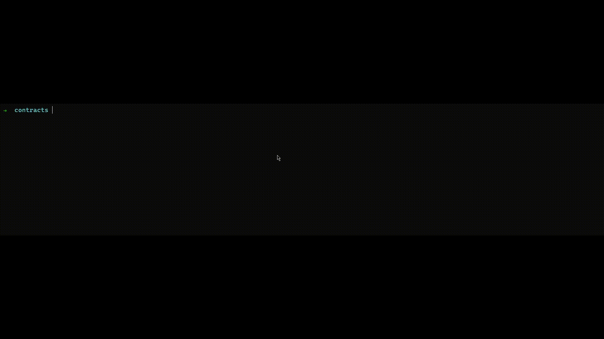

# Solidity Interfacer

Generate Soldity interfaces within seconds!


## Usage

```bash
npx solidity-interface -p <path to your solidity file>
```

This will generate an interface in the contract's folder.


